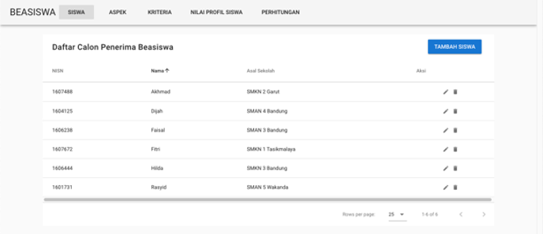
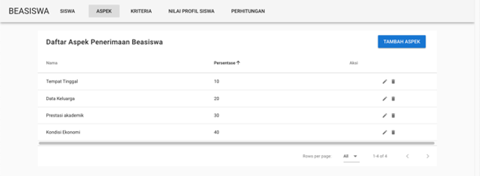
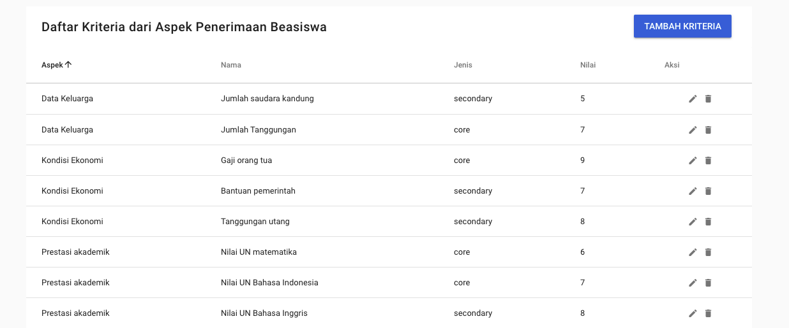
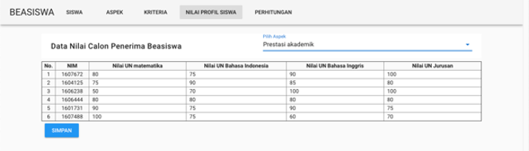
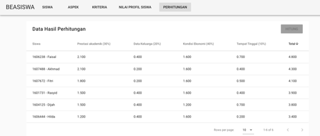

# Beasiswa Profile Matching

Aplikasi ini dibuat sebagai tugas besar untuk mata kuliah Pengantar Sistem Pendukung Keputusan.

## Screenshots

#### 1. Halaman Siswa

Halaman ini berisi CRUD siswa, siswa disini sebagai subjek yang akan dinilai.

#### 2. Halaman Aspek

Halaman ini berisi CRUD aspek, aspek disini adalah kategori penilaian dan seberapa penting aspek yang dinilai dengan menggunakan persentase, semakin penting aspek yang dinilai, semakin besar persentase-nya.

### 3. Halaman Kriteria

Halaman ini berisi CRUD kriteria. Kriteria disini adalah poin-poin penilaian dalam aspek. Dibagi menjadi 2 jenis, Core dan Secondary. Core berarti kriteria utama dari aspek yang dinilai, dan Secondary berarti kriteria pendukung dari aspek yang dinilai.

#### 4. Halaman Nilai Profil

Halaman ini berisi CRUD nilai profil, disini tiap kriteria di isi sesuai dengan keadaan, dan nilai yang di input akan dinormalisasikan sesuai nilai tiap kriteria sehingga bisa dihitung.

#### 5. Halaman Hasil

Halaman ini berisi hasil dari nilai yang sudah diisi pada halaman sebelumnya, dengan menggunakan metode Profile Matching.